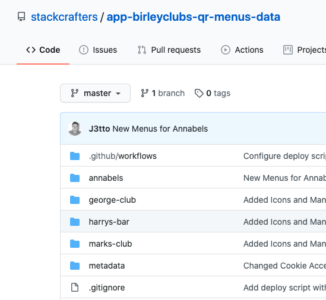
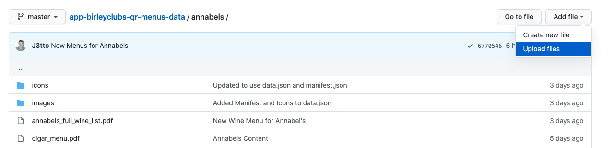
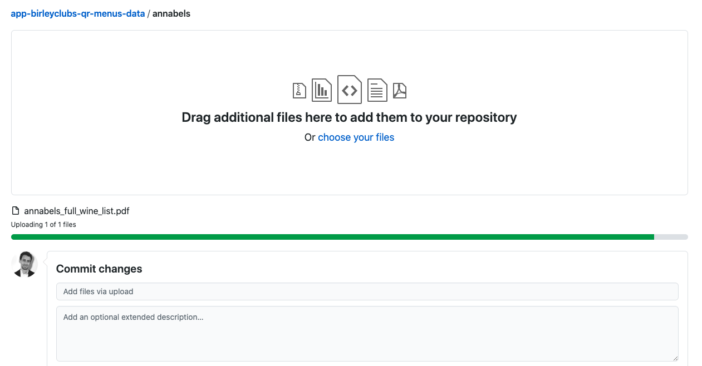
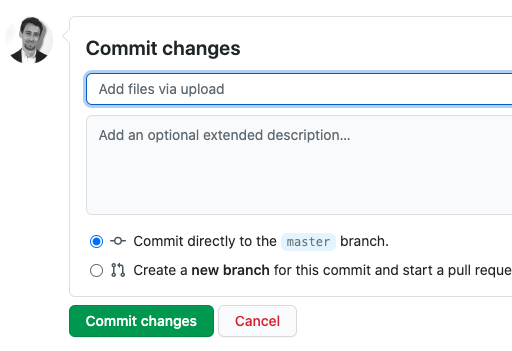

# The Birley Clubs QR Menu Minisite - Data

Menu and asset repository for Birley Clubs QR mini-sites.

PDF, JPG and PNGs pushed into the site folders will be automatically version hashed and deployed.

## PDF Update Instructions

To push menu updates to any of the 4 sites, follow these instructions.

You must have write access to this repository to make updates. If you do not have access please email contact@stackcrafters.com for support.

1. Starting on the main repository listing (this page), find the folder for the site you want to update. In this example, we'll select Annabel's. 

    

2. Within the site folder, identify the PDF files you need to replace. In this example, we'll update the wine menu. Note that this file has a particular name `annabels_full_wine_list.pdf`.
When uploading the new version we need to use the exact same name as the file we're updating. Name the file correctly before proceeding to upload it.
    
    

3. Drag and drop your new, correctly named menu file(s) in to this window, or alternatively click 'Add Files' > 'Upload Files' from the menu.

    
    
    As you drag items in to this window, they are uploaded ready to be 'committed' in to the repository.
    This means that your files will be accepted and replace any existing versions.

4. Near the bottom of the page you'll see a summary of the files you've uploaded, and an area where you can type a short 
message to explain the changes you're making. For example 'Updated Annabel's wine menu'.  

    
    
    Keep the setting to 'commit directly to the master branch'.
    
    When you've finished, click 'Commit'.
    
    [You can use this link to check if your menu update has applied correctly.](https://birleyclubs.app.dev.stackcrafters.com/qr)
    
    Within around 5 minutes you should see your changes applied to the live QR sites.